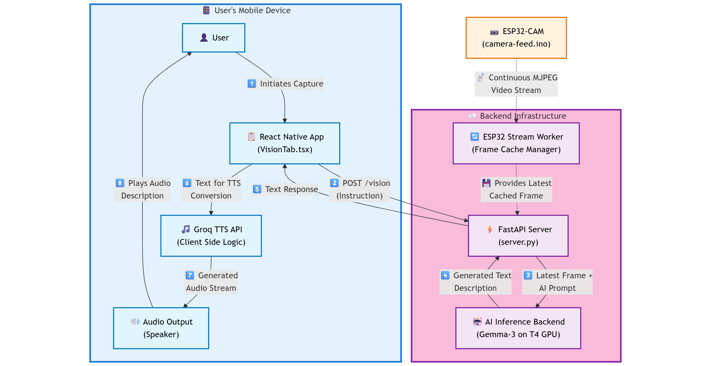

**Paper 1: Core Assistive Vision System (FastAPI Server + Mobile App Focus)**

**Possible Title:**

**AuraVision: An Integrated System for Enhanced Situational Awareness for the Visually Impaired via AI-Powered Image Description and Auditory Feedback**

**Abstract:**

"Navigating and understanding complex environments poses significant challenges for visually impaired individuals. This paper presents a novel assistive vision system designed to provide real-time scene descriptions, enhancing situational awareness and independence. The system architecture integrates an ESP32-CAM for image acquisition, which streams video data to a robust FastAPI backend server. This server processes the incoming frames and leverages a powerful, locally-hosted multimodal AI model (Gemma-3 4B on NVIDIA T4) with an optimized prompt to generate concise and contextually relevant textual descriptions of the visual scene. These descriptions are then relayed to a React Native mobile application, which delivers them to the user via integrated Text-To-Speech (TTS) functionality. Key features include an auto-capture mode for continuous environmental updates and a history log for user reference. We detail the system's design, implementation, the critical role of prompt engineering for tailored AI output, and discuss its potential to serve as an effective aid for the visually impaired. Preliminary evaluations focus on end-to-end latency and the qualitative utility of the generated descriptions."

**Key elements in this abstract:**
*   **Problem:** Challenges for visually impaired individuals.
*   **Solution:** Your system and its name (optional).
*   **Key Components:** ESP32-CAM, FastAPI server, Local AI (Gemma-3/T4), React Native App, TTS.
*   **Core Innovation/Features:** Optimized prompt, real-time nature, specific AI model, mobile delivery.
*   **What the paper covers:** Design, implementation, prompt engineering.
*   **Evaluation aspect:** Latency, qualitative utility.
*   **Impact:** Enhancing situational awareness and independence.

---

**Keywords:**

Assistive Technology, Visual Impairment, Scene Description, Multimodal AI, Large Language Models (LLMs), Gemma, ESP32-CAM, Wearable Camera, FastAPI, React Native, Text-To-Speech (TTS), Real-Time Systems, Prompt Engineering, Situational Awareness.

**Introduction:**

"Individuals with visual impairments (VI) often face significant challenges in independently navigating and interpreting their surroundings. Traditional assistive tools, while beneficial, may not always provide the dynamic, context-rich information needed for comprehensive situational awareness. Recent advancements in artificial intelligence, particularly in multimodal large language models (LLMs), present a transformative opportunity to bridge this gap by enabling machines to understand and describe visual scenes in natural language.

This paper introduces AuraVision, an integrated assistive system designed to empower visually impaired users with real-time auditory descriptions of their environment. AuraVision leverages a low-cost ESP32-CAM as a wearable image acquisition device, continuously streaming visual data to a dedicated backend server. This server, built with FastAPI for robust and efficient handling of concurrent requests, processes the incoming video frames. The core of the scene understanding capability lies in a powerful, locally-hosted multimodal AI model, Gemma-3 4B, running on an NVIDIA T4 GPU. A key contribution of our work is the development of an optimized instruction prompt specifically engineered to guide the AI in generating descriptions that maximize utility and clarity for VI users, focusing on objects, obstacles, text, and overall environmental context.

The AI-generated textual descriptions are then transmitted to a cross-platform mobile application developed using React Native. This application serves as the primary user interface, delivering the information audibly through integrated Text-To-Speech (TTS) technology. AuraVision incorporates features such as an automated capture mode for continuous environmental feedback and a history log, further enhancing its usability. This paper details the architecture, design choices, and implementation of each component, with a particular focus on the interplay between the hardware, the server-side processing, the AI model, and the user-facing mobile application. We also discuss the crucial role of prompt engineering in tailoring AI outputs for this specific assistive context and present our approach to evaluating the system's efficacy in terms of responsiveness and the qualitative value of the generated narratives."

---

**Methodology**

This section details the methodological approach employed in the development and initial evaluation of the AuraVision system. It covers the system architecture, the implementation specifics of each core component, the data flow during an operational cycle, and the planned evaluation strategy.

**3.1 System Architecture and Component Implementation**

The AuraVision system is designed as a modular, multi-component architecture to facilitate real-time scene understanding and auditory feedback for visually impaired users. The key components are:

*   **3.1.1 ESP32-CAM Image Acquisition Module:**
    *   **Hardware:** An ESP32-CAM board equipped with an OV2640 camera sensor is utilized for visual input.
    *   **Firmware:** Custom C/C++ firmware (detailed in `camera-feed.ino.txt`) is deployed on the ESP32. This firmware initializes the camera, connects to a Wi-Fi network (SSID: "Seyam 2.4"), and hosts an HTTP server. The server streams captured video as an Motion JPEG (MJPEG) feed at a resolution of VGA (640x480) with a JPEG quality of 10 when PSRAM is available, or QQVGA (160x120) otherwise. The stream is accessible via `http://192.168.0.237/`.
    *   **Streaming Protocol:** The MJPEG stream consists of a sequence of JPEG images, each delimited by boundary markers, allowing continuous video feed over HTTP.

*   **3.1.2 FastAPI Backend Server:**
    *   **Technology:** A Python-based backend server developed using the FastAPI framework (`server.py`).
    *   **MJPEG Ingestion:** A dedicated background thread (`esp32_stream_worker`) continuously connects to the ESP32-CAM's MJPEG stream URL. It parses the stream, extracts individual JPEG frames, decodes them using OpenCV to ensure validity, and stores the latest valid frame (`latest_frame`) in memory along with its timestamp.
    *   **Vision API Endpoint (`/vision`):** This POST endpoint receives requests (optionally with a custom instruction) from the client application. Upon request, it retrieves the `latest_frame`, Base64 encodes it, and prepares a JSON payload for the AI backend. This payload includes the `OPTIMIZED_PROMPT` (see Section X for prompt details) and the image data URL.
    *   **AI Backend Communication:** The server uses the `httpx` asynchronous library to send the payload to the `AI_BACKEND_URL` (`https://model-host/v1/chat/completions`). It awaits the AI's response, parses the generated text description, and returns it to the client.
    *   **Status Endpoint (`/status`):** A GET endpoint that reports the connectivity status of the ESP32-CAM based on the recency of the `latest_frame`.

*   **3.1.3 AI Inference Backend:**
    *   **Model:** A Gemma-3 4B parameter multimodal model, running in a GGUF format via `llama.cpp`.
    *   **Hardware:** Hosted on an NVIDIA T4 GPU-enabled server.
    *   **API:** The model is exposed via an OpenAI-compatible API endpoint, accepting JSON payloads with image data URLs and text prompts, and returning textual descriptions.

*   **3.1.4 React Native Mobile Application:**
    *   **Technology:** A cross-platform mobile application developed using React Native and Expo (`vision.tsx`).
    *   **User Interface:** Provides controls for manual capture, toggling auto-capture mode (with configurable intervals), enabling auto-TTS, viewing the latest AI response, and browsing a history of responses and system logs.
    *   **Server Communication:** Uses `axios` to interact with the FastAPI backend server's `/vision` and `/status` endpoints.
    *   **Text-To-Speech (TTS) Integration:** Utilizes the `playGroqTTS` utility function, which sends the AI-generated text description to the Groq API (`https://api.groq.com/openai/v1/audio/speech`). The API returns WAV audio data, which is saved locally using `expo-file-system` and played back using `expo-av`.

**3.2 Operational Data Flow**

The typical operational cycle for a vision request is as follows (refer to Figure 1):
1.  The ESP32-CAM continuously captures and streams JPEG frames.
2.  The FastAPI server's background worker fetches and stores the latest frame.
3.  The user, via the React Native app, initiates a capture (manually or via auto-capture).
4.  The React Native app sends a POST request to the FastAPI server's `/vision` endpoint.
5.  The FastAPI server retrieves the latest frame, prepares the payload with the `OPTIMIZED_PROMPT` and image.
6.  The FastAPI server sends this payload to the AI Inference Backend.
7.  The AI Backend processes the image and prompt, generating a textual description.
8.  The AI Backend returns the description to the FastAPI server.
9.  The FastAPI server forwards the description to the React Native app.
10. The React Native app displays the text and, if enabled, initiates TTS playback via the Groq API.
11. The Groq API returns audio data, which is played to the user.

**Figure 1: AuraVision System Operational Data Flow Diagram**




**3.3 Evaluation Strategy**

The evaluation of AuraVision will focus on:
*   **Performance Metrics:**
    *   *End-to-End Latency:* Measured from the moment a capture is initiated on the mobile app to the start of TTS audio playback. This will be broken down by component where feasible (e.g., app-to-server, server-to-AI, AI-inference, TTS API).
    *   *Frame Rate Consistency:* From the ESP32 stream.
*   **Qualitative Assessment:**
    *   *Usefulness and Clarity of Descriptions:* Conduct user studies with visually impaired individuals. Participants will be asked to perform tasks in controlled environments using the system. Feedback will be collected through think-aloud protocols, post-task questionnaires (e.g., System Usability Scale - SUS), and semi-structured interviews focusing on the relevance, accuracy, and actionability of the AI-generated descriptions.
    *   *Impact of Optimized Prompt:* Compare descriptions generated with the `OPTIMIZED_PROMPT` versus a generic prompt.
*   **System Robustness:**
    *   Behavior under varying network conditions (e.g., Wi-Fi signal strength).
    *   Error handling (e.g., ESP32 disconnection, AI backend timeouts).

---


**4. Implementation Details**

This section provides a more granular look at the implementation specifics of the key components and workflows within the AuraVision system, complementing the architectural overview provided in Section 3 (Methodology).

**4.1 ESP32-CAM Firmware and Streaming**

The ESP32-CAM firmware (`esp.ino`) utilizes the `esp_camera.h` library for camera initialization and frame capture, and `esp_http_server.h` to manage the MJPEG stream.
*   **Camera Configuration:** The camera is configured for `PIXFORMAT_JPEG`. Frame size is dynamically set to `FRAMESIZE_VGA` (640x480) with `jpeg_quality = 10` if PSRAM is detected; otherwise, it defaults to `FRAMESIZE_QQVGA` (160x120) with `jpeg_quality = 15` and `fb_count = 1` to conserve resources. The XCLK frequency is set to 20MHz.
*   **MJPEG Stream Handler (`stream_handler`):** Upon an HTTP GET request to the root path (`/`), this handler enters a loop. In each iteration, it attempts to capture a frame using `esp_camera_fb_get()`. If successful, the JPEG frame buffer (`fb->buf`) and its length (`fb->len`) are obtained. The frame is then sent as a chunk in the multipart/x-mixed-replace response, preceded by a boundary string (`--frame`) and content headers specifying `image/jpeg` and the content length. A `delay(30)` is introduced between frames to regulate the stream to approximately 33 FPS and reduce ESP32 load. The frame buffer is returned using `esp_camera_fb_return(fb)`.

**4.2 FastAPI Backend Server Implementation**

The backend server (`server.py`) is built using Python 3.x and FastAPI (version X.Y.Z).
*   **MJPEG Stream Ingestion (`esp32_stream_worker`):**
    *   This function runs in a daemonized `threading.Thread`.
    *   It uses `httpx.stream("GET", ESP32_STREAM_URL, timeout=10)` to connect to the ESP32.
    *   JPEG frames are extracted from the byte stream by searching for start-of-image (`b'\xff\xd8'`) and end-of-image (`b'\xff\xd9'`) markers.
    *   Extracted JPEGs are validated by attempting to decode them using `cv2.imdecode(np.frombuffer(jpg, dtype=np.uint8), cv2.IMREAD_COLOR)`.
    *   The most recent valid raw JPEG bytestring (`latest_frame`) and its capture time (`latest_frame_time`) are stored globally.
    *   Connection errors or non-200 responses lead to a 5-second pause before a reconnection attempt.
*   **Vision Endpoint (`/vision`):**
    *   Defined as an `async def` function.
    *   Instruction Prompt: The primary instruction is `OPTIMIZED_PROMPT`, defined as:
        ```
        "You are an assistive vision system for the visually impaired. Given an image from a wearable or mobile camera, describe the scene in a way that maximizes situational awareness and independence. Clearly identify objects, obstacles, people, and signage. If there is text, read it aloud and explain its context. Use short, direct sentences and avoid technical jargon. Prioritize information that would help a visually impaired user navigate or understand their environment."
        ```
        This prompt can be overridden by a client-sent `instruction` field (either via `Form` data or a JSON body, checked via `request.headers.get("content-type")`).
    *   Image Preparation: The `latest_frame` (raw JPEG bytes) is Base64 encoded and formatted into a data URL: `f"data:image/jpeg;base64,{image_b64}"`.
    *   AI Payload Construction: The payload for the AI backend includes `max_tokens: 100` and a messages array structured for multimodal input, containing the text instruction and the image URL.
    *   Asynchronous AI Request: An `httpx.AsyncClient(timeout=30)` sends a POST request to `AI_BACKEND_URL`.
    *   Response Handling: The JSON response from the AI is parsed to extract `data["choices"][0]["message"]["content"]`. Specific `httpx.HTTPStatusError` exceptions are caught to provide informative error messages.
*   **Logging:** `loguru` is used for detailed request and internal logging, including request IDs and timing.

**4.3 AI Model Selection, Configuration, and Interaction**

The core scene understanding capability of AuraVision is enabled by the Gemma 3 4B parameter multimodal model. This model is accessed via an externally hosted, OpenAI-compatible API.

*   **4.3.1 Justification for Gemma 3 4B Selection:**
    The choice of Gemma 3 4B was predicated on its suitability for a real-time assistive system, considering the following attributes as reported by Google:
    *   **Performance and Efficiency:** Gemma 3 4B is engineered for high inference throughput. Google's reports indicate that models in the Gemma 3 family can achieve over 267 tokens per second on accessible NVIDIA T4 GPUs. This level of performance is critical for AuraVision's goal of minimizing latency between visual capture and auditory feedback, thereby enhancing the user's real-time interaction with their environment. The model's efficiency on T4-class hardware also supports the feasibility of private or edge-like deployments.
    *   **Intelligence-to-Resource Ratio:** Despite its 4-billion parameter size, Gemma 3 4B is documented to exhibit strong performance, outperforming other open models of comparable or even larger sizes on various academic benchmarks covering language comprehension, reasoning, and safety. This effective balance of advanced capability against manageable resource requirements is vital for generating high-quality, contextually relevant scene descriptions.
    *   **Instruction Following and Multimodal Capability:** The model's proficiency in adhering to complex instructions is key to leveraging AuraVision's `OPTIMIZED_PROMPT`. Its inherent multimodal design allows it to seamlessly process and integrate information from both the textual prompt and the visual data (camera image).
    *   **Accessibility and Openness:** The Gemma model family is generally released with open weights, fostering research and development. This aligns with the project's aim to build upon accessible and adaptable AI technologies.

    These characteristics—high inference speed, robust intelligence for its size, and native multimodality—render Gemma 3 4B a highly suitable engine for AuraVision, directly influencing the system's potential for practical, real-world assistance.

*   **4.3.2 AI Backend Configuration and API Interaction:**
    *   The FastAPI server constructs a JSON payload for the AI backend. This payload includes the `OPTIMIZED_PROMPT` and the Base64 encoded image formatted as a data URL.
    *   The `max_tokens` parameter for the AI generation is set to 100. This encourages the model to produce concise descriptions, which are more suitable for quick auditory assimilation by the user and help maintain lower perceived latency. Other generation parameters (e.g., temperature) use the AI backend's default settings.
    *   The AI backend processes this multimodal input and returns a JSON response, from which AuraVision extracts the primary textual description (typically `choices.message.content`).

**4.4 React Native Mobile Application (`vision.tsx`)**

Developed with React Native (Expo SDK version 53), TypeScript.
*   **State Management:** `useState` hooks manage UI state, server connectivity, loading indicators, AI responses, history, logs, and auto-capture/TTS settings.
*   **Backend API Calls:** `axios` is used for GET requests to `/status` (polling every 2 seconds if backend is okay) and POST requests to `/vision`. Vision requests have a 60-second timeout.
*   **Auto-Capture Logic:**
    *   If `autoCapture` is true and `autoTTS` is false: `setInterval` calls `handleCapture()` at `autoCaptureInterval` milliseconds.
    *   If `autoCapture` and `autoTTS` are both true: A `while` loop in an `async` function (`runAutoTTS`) chains requests. A vision request is made; upon receiving a response, `playGroqTTS` is called. Only after TTS playback completes (approximated by `setTtsPlaying` and a short buffer of 500ms), the next vision request is initiated. This ensures sequential description and playback.
*   **TTS Implementation (`playGroqTTS.ts`):**
    *   The `playGroqTTS` function makes a POST request to `https://api.groq.com/openai/v1/audio/speech`.
    *   Payload: `{ model: 'playai-tts', voice: 'Fritz-PlayAI', input: text, response_format: 'wav' }`.
    *   API Key: `GROQ_API_KEY` is used as an environment variable. For development, it's set in the `.env` file.
    *   Audio Handling: The `arraybuffer` response is converted to Base64. `FileSystem.writeAsStringAsync` saves the audio to `FileSystem.cacheDirectory + 'tts.wav'`. `Audio.Sound.createAsync` loads and plays the WAV file. The sound object is unloaded upon playback completion.
*   **Logging:** User-facing logs are appended to a state array and displayed in the `LogPanel`.

---

We need to add these to the bibliography of each paper, formatted according to the conference/journal style.

*    Google. "Gemma 3 outperforms other models in its class." *Google Blog*, May 2024 (or specific date of post). [Online]. Available: [Insert direct URL to the first blog post you provided: `https://blog.google/technology/developers/gemma-3/`]
*   Google Developers. "Introducing Gemma 3." *Google Developers Blog*, May 2024 (or specific date of post). [Online]. Available: [Insert direct URL to the second blog post you provided: `https://developers.googleblog.com/en/introducing-gemma3/`]