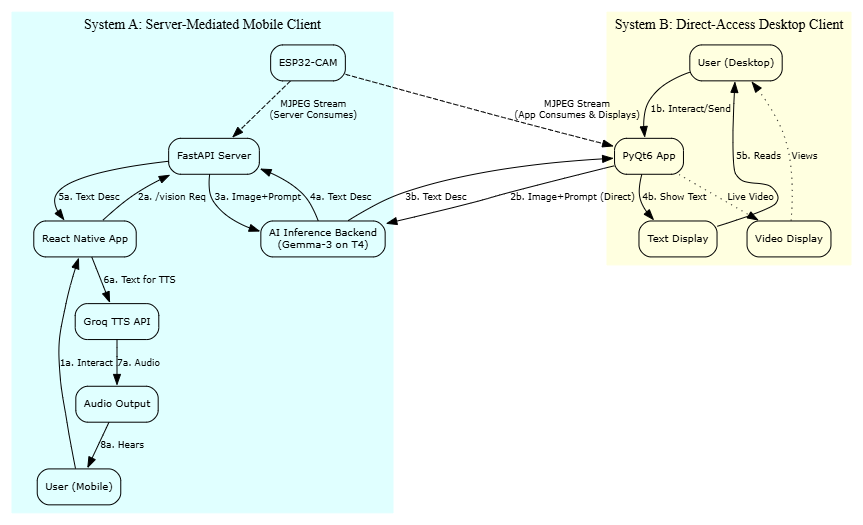

**Paper 2: Comparative Analysis of User Interfaces and System Deployment Strategies**

**Possible Titles:**

**Architectures for AI-Driven Visual Assistance: Evaluating Server-Mediated Mobile and Direct-Access Desktop Client Implementations**

**Abstract:**

"Artificial intelligence-driven vision assistance systems offer transformative potential for individuals with visual impairments and various other applications. However, the optimal client architecture and user interface modality can vary significantly based on user needs, environmental context, and available infrastructure. This paper presents and comparatively analyzes two distinct client implementations for an AI scene description system powered by an ESP32-CAM and a multimodal AI backend (Gemma-3 4B). The first is a server-mediated mobile application (React Native with FastAPI) designed for portability and auditory feedback (Text-To-Speech), prioritizing ease of use for visually impaired individuals. The second is a direct-access desktop application (PyQt6) offering live video preview and direct AI backend interaction, suitable for development, sighted assistance, or stationary use. We evaluate these architectures based on features, deployment considerations (e.g., network dependency, API key management), potential latency implications, and user experience trade-offs. Our findings provide insights into selecting appropriate client strategies for AI vision systems, highlighting the benefits and drawbacks of server-intermediated versus direct-access models and emphasizing the importance of versatile interface design to cater to a broader range of users and use cases."

**Key elements in this abstract:**
*   **Problem:** Need for versatile AI vision interfaces.
*   **Solution:** Presenting and comparing two distinct client implementations.
*   **Key Systems Compared:**
    *   Mobile App (React Native + FastAPI Server) -> focus on features for VI user.
    *   Desktop App (PyQt6) -> focus on features for sighted user/developer.
*   **Core Comparison Points:** Architecture (server-mediated vs. direct), features, deployment, latency, UX.
*   **What the paper covers:** Analysis of architectures and interfaces.
*   **Impact/Contribution:** Insights into client strategy selection for AI vision systems.

---


**Keywords:**

AI Vision Assistance, System Architecture, User Interface Design, Mobile Computing, Desktop Applications, ESP32-CAM, Multimodal AI, Gemma, Client-Server Models, Direct Access, FastAPI, React Native, PyQt6, Text-To-Speech (TTS), Comparative Analysis, Deployment Strategies, User Experience (UX).

**Introduction:**

"The proliferation of powerful multimodal artificial intelligence (AI) models has opened new frontiers for assistive technologies, particularly in the domain of vision assistance. Systems capable of describing visual scenes in real-time can significantly enhance independence and safety for visually impaired individuals, and also find applications in robotics, remote guidance, and augmented reality. While the core AI processing is crucial, the effectiveness of such systems heavily relies on the client architecture and the user interface (UI) through which information is delivered and interacted with. The choice of client implementation—ranging from lightweight mobile apps to feature-rich desktop solutions—presents distinct trade-offs in terms of portability, functionality, resource requirements, and deployment complexity.

This paper investigates and comparatively analyzes two distinct client architectures for an AI-powered scene description system. The core visual input is sourced from an ESP32-CAM, and the scene understanding is performed by a Gemma-3 4B multimodal AI model. The first architecture explored is a server-mediated mobile solution: a React Native application designed for visually impaired users, which communicates with a FastAPI backend server. This server acts as an intermediary, handling image ingestion from the ESP32, interfacing with the AI model, and relaying textual descriptions to the mobile app for Text-To-Speech (TTS) output. This model prioritizes a lightweight mobile client and centralized AI interaction.

In contrast, the second architecture is a direct-access desktop application built with PyQt6. This client directly consumes the MJPEG stream from the ESP32-CAM for live visual preview and communicates independently with the AI backend. This approach offers immediate visual feedback and potentially reduced latency for AI requests by eliminating an intermediary server, making it suitable for sighted users, developers, or stationary assistive scenarios. This study examines the design, implementation, and characteristics of both client systems. We conduct a comparative analysis focusing on key aspects such as feature sets (e.g., live preview vs. TTS), architectural implications (e.g., network dependencies, API key management), potential performance differences, user experience considerations for their respective target audiences, and overall deployment strategies. Through this analysis, we aim to provide valuable insights for developers and researchers in selecting and designing appropriate client architectures for diverse AI vision assistance applications."

---


**Methodology**

This study employs a comparative methodology to analyze two distinct client architectures for an AI-powered vision assistance system. Both architectures leverage common core components for image acquisition (ESP32-CAM) and AI-driven scene understanding (Gemma-3 4B model), allowing for a focused comparison of the client-side implementations and their interaction pathways.

**3.1 Core System Components (Common Foundation)**

*   **3.1.1 ESP32-CAM Image Source:** As described in Paper 1 (Section 3.1.1), an ESP32-CAM provides a continuous MJPEG stream over Wi-Fi (`http://192.168.0.237/`). This serves as the consistent visual input for both client systems under evaluation.
*   **3.1.2 AI Inference Backend:** As described in Paper 1 (Section 3.1.3), a Gemma-3 4B model hosted on an NVIDIA T4 server provides the core scene description capabilities via an OpenAI-compatible API (`https://model-server-url/v1/chat/completions`).

**3.2 Client System Implementations for Comparison**

*   **3.2.1 System A: Server-Mediated Mobile Client Architecture**
    *   **Description:** This architecture comprises the React Native mobile application and the FastAPI backend server, as detailed in Paper 1 (Sections 3.1.2 and 3.1.4).
    *   **Key Characteristics:** Designed for portability and visually impaired users. Relies on the FastAPI server as an intermediary to process ESP32 streams, manage AI backend communication, and simplify client logic. Delivers information primarily via Text-To-Speech (TTS) using the Groq API.
    *   **Data Flow:** User (Mobile App) -> FastAPI Server -> AI Backend -> FastAPI Server -> User (Mobile App with TTS). The ESP32 stream is consumed by the FastAPI server.

*   **3.2.2 System B: Direct-Access Desktop Client Architecture**
    *   **Technology:** A desktop application developed using Python and the PyQt6 GUI framework (`app.py`).
    *   **MJPEG Consumption & Display:** The PyQt6 application directly connects to the ESP32-CAM's MJPEG stream URL. It fetches, decodes (using OpenCV), and displays the video frames in real-time within its GUI.
    *   **Direct AI Backend Communication:** Upon user command or auto-trigger, the application captures the current frame from its displayed stream, Base64 encodes it, and constructs a JSON payload (similar to the FastAPI server's payload, using the `DEFAULT_INSTRUCTION`). This payload is sent *directly* to the AI Inference Backend URL using the `requests` library in a separate `QThread` to maintain GUI responsiveness.
    *   **User Interface:** Provides a live video feed, an input field for the instruction prompt, controls for manual/automatic sending of frames to the AI, a display area for the AI's textual response, and a log panel.
    *   **Key Characteristics:** Designed for stationary use, development, or sighted assistance. Offers live visual feedback. Bypasses an intermediary server for AI interaction. Does not currently feature TTS.
    *   **Data Flow:**
        1.  ESP32 Stream -> PyQt6 App (for display and frame capture).
        2.  User (Desktop App) -> AI Backend (Direct Image + Prompt).
        3.  AI Backend -> User (Desktop App with text display).

**3.3 Comparative Framework and Evaluation Metrics**

The two client architectures will be compared based on the following criteria:

*   **3.3.1 Feature Set Analysis:** A qualitative comparison of available features, including:
    *   Feedback modalities (visual preview, textual display, auditory output).
    *   Automation capabilities (auto-capture, auto-send intervals).
    *   Portability and target user environment.
    *   Configurability of prompts and settings.

*   **3.3.2 Architectural Analysis:**
    *   Complexity of client-side logic.
    *   Network dependencies and number of network hops for a vision request.
    *   Handling of sensitive information (e.g., AI backend access, though no explicit keys are used in the provided AI backend URL).
    *   Scalability considerations (e.g., server load vs. direct client connections to AI).

*   **3.3.3 Performance Metrics:**
    *   *End-to-End Latency:*
        *   System A: Time from capture initiation on mobile app to start of TTS.
        *   System B: Time from send command on desktop app to display of text response.
    *   *AI Interaction Latency:* Time taken for the AI backend request-response cycle (measured at the client or server initiating the AI call).
    *   *Client-side Resource Usage (Exploratory):* CPU and memory footprint of the mobile vs. desktop application during operation, if significant differences are observable.

*   **3.3.4 User Experience (UX) Considerations:**
    *   Heuristic evaluation of each interface based on Nielsen's usability heuristics, tailored to their intended primary users (VI users for System A, sighted users/developers for System B).
    *   Discussion of the suitability of each interface for different tasks and contexts.

**Figure 2: Comparative Data Flow for Client Architectures**



---


**4. Implementation Details**

This section details the specific implementation choices for the two client architectures under comparison: the server-mediated mobile client (System A) and the direct-access desktop client (System B). Common components like the ESP32-CAM firmware and the AI Inference Backend are implemented as described in [Reference to Paper 1's Methodology/Implementation or a shared Appendix, e.g., "Section 3.1 of our accompanying work [Citation to Paper 1]"] to avoid redundancy.


**4.1 Core AI Model: Gemma 3 4B**

The scene description capabilities for both System A and System B are provided by a Gemma 3 4B parameter multimodal model, accessed via an externally hosted, OpenAI-compatible API.

*   **4.1.1 Rationale for Model Selection in the Project Context:**
    The selection of Gemma 3 4B was based on its reported characteristics, which align with the demands of versatile AI vision assistance systems:
    *   **High Inference Throughput:** Google's publications indicate that Gemma 3 models, including the 4B variant, achieve high token generation rates (e.g., over 267 tokens/second on NVIDIA T4 GPUs). This is a crucial factor for applications aiming for low-latency responses, irrespective of the client architecture.
    *   **Favorable Performance-to-Size Ratio:** Gemma 3 4B is cited as delivering strong performance on diverse benchmarks relative to its parameter count, often outperforming larger models. This efficiency is beneficial for projects that may operate with moderately resourced backend infrastructure.
    *   **Inherent Multimodal Processing:** The model's native ability to understand combined image and text inputs is fundamental to the core task of visual scene description.
    *   **Openness:** The general availability of Gemma models supports broader research and development in AI-driven assistance.

    The Gemma 3 4B model's profile—combining speed, capable intelligence for its size, and multimodal input handling—provides a robust foundation for evaluating different client interaction patterns as explored in this comparative study.

*   **4.1.2 AI Backend Interaction Principles:**
    Both client architectures, whether System A's server or System B's desktop application, prepare a JSON payload for the Gemma 3 4B API. This payload contains a textual instruction (the `OPTIMIZED_PROMPT` from the server in System A, or the `DEFAULT_INSTRUCTION`/user input in System B) and a Base64 encoded image formatted as a data URL. The AI interaction is configured with `max_tokens` set to 100 to encourage brevity in the generated descriptions.

**4.2 System B: Direct-Access Desktop Client Implementation (`app.py`)**

System B is a standalone desktop application developed using Python 3.x and PyQt6 (version X.Y.Z).
*   **MJPEG Stream Handling and Display:**
    *   `fetch_mjpeg_frame(ESP32_URL)` function: Uses `requests.get(..., stream=True)` to connect to the ESP32. It iteratively consumes content, searching for JPEG start (`b'\xff\xd8'`) and end (`b'\xff\xd9'`) markers to extract individual frames.
    *   Frame Conversion: Extracted JPEG bytestrings are decoded into OpenCV `cv2.Mat` objects using `cv2.imdecode`. These are then converted to `QImage` (Format_RGB888) and `QPixmap` for display in a `QLabel` (`video_label`).
    *   Display Update: A `QTimer` triggers `update_frame()` every 30ms, which fetches the next frame from a generator created by `fetch_mjpeg_frame()` and updates the `video_label`.
*   **AI Backend Interaction (`BackendThread`):**
    *   Threading: A `QThread` subclass is used to send requests to the AI backend asynchronously, preventing GUI freezes.
    *   Image Preparation: When a request is triggered, the current `self.frame` (an OpenCV `cv2.Mat` object) is encoded back into JPEG format using `cv2.imencode('.jpg', self.frame)`. The resulting buffer is Base64 encoded and formatted into a data URL.
    *   Payload Construction: The payload is similar to System A's server-side construction, using the instruction from `self.instruction_input` (defaulting to `DEFAULT_INSTRUCTION`, which closely mirrors `OPTIMIZED_PROMPT`) and `max_tokens: 100`.
        ```python
        # DEFAULT_INSTRUCTION in app.py
        DEFAULT_INSTRUCTION = "You are an assistive vision system for the visually impaired. Given an image from a wearable camera, describe the scene in a way that maximizes situational awareness and independence. Clearly identify objects, obstacles, people, and signage. If there is text in the scene, read it aloud and explain its context (e.g., sign, label, document). Use short, direct sentences and avoid technical jargon. Prioritize information that would help a visually impaired user navigate or understand their environment."
        ```
    *   Direct API Call: `requests.post(f"{BACKEND_URL}/v1/chat/completions", json=payload, ...)` sends the request directly to the AI inference backend.
    *   Signal/Slot for Updates: `BackendThread` uses `pyqtSignal` to communicate results (`result_signal`), status updates (`status_signal`), and log messages (`log_signal`) back to the main GUI thread.
*   **User Interface Elements:**
    *   Controls: `QLineEdit` for instruction, `QCheckBox` for auto-send, `QSpinBox` for interval (ms), `QPushButton` for actions.
    *   Feedback: `QTextEdit` for AI response and logs, `QStatusBar` for status messages.
*   **Auto-Send Logic:** A `QTimer` (`auto_send_timer`) calls `send_to_backend()` at the user-defined interval when the "Auto-send" checkbox is active.

**4.3 Key Implementation Differences for Comparison**

*   **AI Interaction Point:** System A's mobile client calls its FastAPI server, which then calls the AI. System B's desktop client calls the AI backend directly.
*   **Prompt Management:** In System A, the `OPTIMIZED_PROMPT` is primarily managed server-side. In System B, a similar `DEFAULT_INSTRUCTION` is client-side and directly editable by the user.
*   **ESP32 Stream Consumption:** In System A, the FastAPI server consumes the stream. In System B, the PyQt6 application consumes it directly. This means if both were run pointing to the same ESP32, the ESP32 would serve two clients.
*   **Feedback Modality:** System A prioritizes TTS. System B provides live video and textual AI output.

**(Optional Graphviz Diagram for the Paper to show the AI Call Path)**


This diagram visually contrasts where the call to the AI_Backend originates.

---


We need to add these to the bibliography of each paper, formatted according to the conference/journal style.

*    Google. "Gemma 3 outperforms other models in its class." *Google Blog*, May 2024 (or specific date of post). [Online]. Available: [Insert direct URL to the first blog post you provided: `https://blog.google/technology/developers/gemma-3/`]
*   Google Developers. "Introducing Gemma 3." *Google Developers Blog*, May 2024 (or specific date of post). [Online]. Available: [Insert direct URL to the second blog post you provided: `https://developers.googleblog.com/en/introducing-gemma3/`]